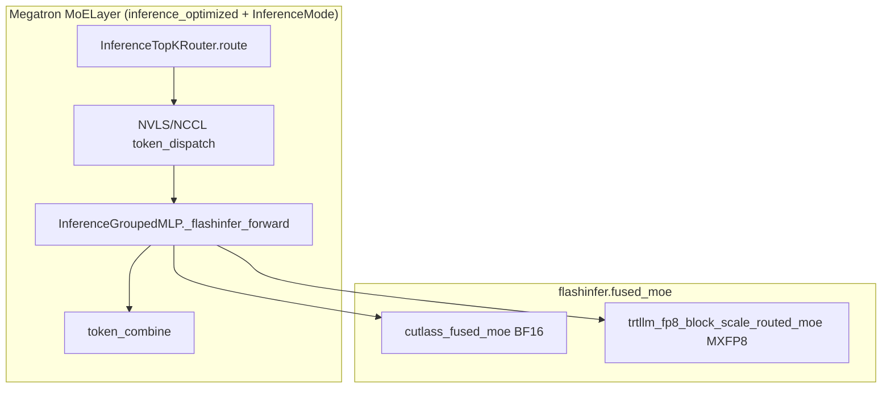

# Design: FlashInfer MoE (TRT-LLM + Mega) and TE-Free Prototype Experts in Megatron-Core

**Status:** Plan / architecture  
**Audience:** Megatron-Core + NeMo-RL inference-optimized MoE work (true on-policy, zero train/gen mismatch experiments)  
**Repo anchor:** `3rdparty/Megatron-Bridge-workspace/Megatron-Bridge/3rdparty/Megatron-LM/` (paths below are relative to Megatron-LM unless noted)

---

## Milestone roadmap (executive)

| Milestone | Outcome | Where you develop | Done when |
|-----------|---------|-------------------|-----------|
| **M1** | Call **FlashInfer mega** (`moe_ep`) from Megatron inference MoE | **Megatron container** (Megatron-LM fork / patch) | Forward pass runs with `inference_grouped_gemm_backend=flashinfer_mega` (or equivalent); multirank smoke if EP>1 |
| **M2** | **Train** with mega in forward + **BF16 reference backward** (custom autograd, TE-free experts) | **Megatron container** | `loss.backward()` updates expert weights via reference; optional flag toggles mega forward; grad check vs reference-only |
| **M3** | **Both paths** selectable from **NeMo-RL** (train worker + Megatron gen worker) | **NeMo-RL repo** + pinned Megatron image/commit | Recipe YAML drives M1 gen and M2 train; non-colocated (or colocated) job completes without new validation surprises |

M1 and M2 do **not** require NeMo-RL initially: use Megatron unit/functional tests, a minimal MoE forward script, and a tiny pretrain/SFT loop inside the container. M3 wires config merge, generation backend, and zero-KL gates in `nemo_rl/`.

---

## 1. Goals and non-goals

### Goals

1. **Document the existing FlashInfer inference MoE path** in Megatron (config → dispatcher → `InferenceGroupedMLP` → `flashinfer.fused_moe`).
2. **Define an integration plan for FlashInfer `moe_ep` mega kernels** ([`flashinfer/moe_ep/backends/mega/kernel`](https://github.com/flashinfer-ai/flashinfer/tree/main/flashinfer/moe_ep/backends/mega/kernel)) as a new inference backend.
3. **Define a TE-free training prototype:** `torch.autograd.Function` where **forward may call a fused kernel** and **backward is defined by a BF16 PyTorch reference** (permute + `grouped_mm` + activation + unpermute), suitable when TE grouped MoE is not acceptable.

### Non-goals (this design)

- Implementing mega **backward** inside FlashInfer.
- Replacing dense layers, attention, or router TE paths in `InferenceSpecProvider` (only **routed expert compute** is in scope for TE replacement).
- Promising on-policy correctness without mega ↔ reference parity measurements.

---

## 2. Terminology

| Term | Meaning |
|------|---------|
| **Training dispatcher** | `MoEAlltoAllTokenDispatcher`, `MoEFlexTokenDispatcher`, or `MoEAllGatherTokenDispatcher` — permuted tokens + `tokens_per_expert`. |
| **Inference dispatcher** | `NCCLAllGatherDispatcher` or `NVLSAllGatherVDispatcher` — EP-wide gather/scatter; FlashInfer path passes **`routing_map`**. |
| **`InferenceMode`** | Process-wide flag: inference engine active vs training / RL logprob path. |
| **`flashinfer.fused_moe`** | Legacy flat APIs: `cutlass_fused_moe`, `trtllm_fp8_block_scale_routed_moe`, etc. |
| **`flashinfer.moe_ep` mega** | Fused EP comm + expert compute; entry `MoEEpLayer(..., backend=MegaConfig(...))`. |

---

## 3. Model construction and MoE module selection

### 3.1 Layer spec entry points

| Function | File | Role |
|----------|------|------|
| `get_inference_optimized_moe_spec()` | `megatron/core/models/gpt/moe_module_specs.py` | Builds `MoELayer` with `InferenceSpecProvider` + `InferenceTopKRouter`. |
| `get_moe_module_spec_for_backend()` | same | Generic MoE spec; uses `backend.grouped_mlp_modules()`. |
| `get_backend("inference_optimized")` | `megatron/core/models/backends.py` | Returns `InferenceSpecProvider`. |

**Call chain (build time):**

```
hybrid_layer_specs.py / gpt_layer_specs.py
  → get_inference_optimized_moe_spec()
    → MoELayer(submodules=MoESubmodules(
         experts=partial(InferenceGroupedMLP, submodules=GroupedMLPSubmodules(
           linear_fc1=TEColumnParallelGroupedLinear,
           linear_fc2=TERowParallelGroupedLinear, ...)),
         router=InferenceTopKRouter))
```

Relevant code:

- `InferenceSpecProvider.grouped_mlp_modules()` → `InferenceGroupedMLP` + TE grouped linears:  
  `megatron/core/models/backends.py` (~L193–L201).
- Docstring tying spec to inference impl:  
  `megatron/core/models/gpt/moe_module_specs.py` (`get_inference_optimized_moe_spec`, ~L101–L108).

**Prototype TE replacement** adds e.g. `PrototypeSpecProvider` or a config branch in `grouped_mlp_modules()` returning `PrototypeGroupedMLP` with plain `nn.Parameter` stacks (no `TEColumnParallelGroupedLinear`).

### 3.2 Config fields (inference MoE)

Defined on `TransformerConfig` in `megatron/core/transformer/transformer_config.py`:

| Field | Default / values | Validated in |
|-------|------------------|--------------|
| `transformer_impl` | `"inference_optimized"` for gen path | `__post_init__` (~L1791+) |
| `inference_grouped_gemm_backend` | `flashinfer`, `te`, `torch`, `vllm` | `InferenceGroupedGemmBackend` enum in `megatron/core/inference/moe/__init__.py` |
| `inference_moe_token_dispatcher_type` | `nvls` (default), `nccl` | MoE + batch_invariant checks |
| `inference_flashinfer_mxfp8_token_capacity` | optional int | FlashInfer MXFP8 + NVLS + EP>1 |
| `batch_invariant_mode` | training/gen parity | disallows FlashInfer backend today (~L1892+) |

NeMo-RL merges generation config via `nemo_rl/models/generation/megatron/config.py` (`transformer_impl: inference_optimized`, etc.).  
Zero-KL defaults: `nemo_rl/models/megatron/zero_train_gen_mismatch.py` (`batch_invariant_mode`, `batch_invariant_backend: te_native` — **conflicts with TE-free prototype**; prototype needs `torch` batch-invariant path or relaxed gates).

---

## 4. Runtime mode switch: training vs inference engine

### 4.1 `InferenceMode`

- **File:** `megatron/core/inference/utils.py`  
- **API:** `InferenceMode.is_active()`, `set_active()`, `active()` context manager, `use_bounded_mxfp8_rows()`.

Modules must use this instead of `self.training` alone when splitting inference vs RL logprob vs training (docstring ~L20–L25).

### 4.2 MoE dispatcher selection

**File:** `megatron/core/transformer/moe/moe_layer.py`

| Phase | Method | Behavior |
|-------|--------|----------|
| Init (inference_optimized) | `MoELayer._setup_inference_mode()` (~L418) | Saves `_training_token_dispatcher`, creates `_inference_token_dispatcher` (`NVLSAllGatherVDispatcher` or `NCCLAllGatherDispatcher`). |
| Each forward | `MoELayer.forward()` (~L669–L680) | If `InferenceMode.is_active()` → inference dispatcher; else training dispatcher. |

FlashInfer backend checks at init (~L374–L391): `HAVE_FLASHINFER`, `require_flashinfer_routed_mxfp8()` for MXFP8, `check_flashinfer_jit_cache_installed()`.

---

## 5. MoE forward call graph (production)

### 5.1 `MoELayer.forward` pipeline

**File:** `megatron/core/transformer/moe/moe_layer.py`

```
MoELayer.forward(hidden_states)
  custom_forward:
    route()                    → TopKRouter / InferenceTopKRouter
    preprocess()               → token_dispatcher.dispatch_preprocess
    dispatch()                 → token_dispatcher.token_dispatch
    routed_experts_compute()   → experts + combine_preprocess
    combine()                  → token_dispatcher.token_combine
    postprocess()              → combine_postprocess, latent proj, shared expert
```

Key methods:

| Step | Method | Line region (approx.) |
|------|--------|------------------------|
| Router | `route()` | ~L470 |
| Pre-dispatch | `preprocess()` | ~L480 |
| EP comm | `dispatch()` → `token_dispatch` | ~L522 |
| Experts | `routed_experts_compute()` | ~L562 |
| EP comm back | `combine()` | ~L599 |

### 5.2 Expert compute branch (inference vs training)

**File:** `megatron/core/transformer/moe/moe_layer.py` — `routed_experts_compute()` (~L576–L593)

**Inference engine active** (`InferenceMode.is_active()` and `_inference_token_dispatcher` exists):

```python
routing_map = self.token_dispatcher.routing_map
expert_output, _ = self.experts(
    dispatched_input, tokens_per_expert, permuted_probs,
    routing_map=routing_map,
)
```

**Training / RL (not inference mode):**

```python
expert_output, _ = self.experts(
    dispatched_input, tokens_per_expert, permuted_probs,
    **expert_kwargs,  # optional NCCL-EP zero-copy buffers
)
```

No `routing_map` kwarg — permute layout from training dispatcher.

### 5.3 Inference token dispatchers

**File:** `megatron/core/transformer/moe/token_dispatcher_inference.py`

| Class | Role |
|-------|------|
| `InferenceAllGatherDispatcherBase` | Holds `_valid_tokens_tensor` for CUDA graphs; read via `_valid_tokens()` in experts / `mcore_fused_moe`. |
| `NCCLAllGatherDispatcher` | Equal or variable token counts; AllGather / ReduceScatter. |
| `NVLSAllGatherVDispatcher` | Variable counts via multimem AGV/RSV; symmetric memory; used with FlashInfer MXFP8 token capacity. |

After gather, **`dispatch_postprocess`** for inference often pass-through (experts consume gathered `hidden_states`, `probs`, **`routing_map`** on dispatcher).

---

## 6. Track A — Current FlashInfer path (no mega)

### 6.1 Expert module

**Class:** `InferenceGroupedMLP`  
**File:** `megatron/core/transformer/moe/experts.py` (~L1163+)  
**Inherits:** `TEGroupedMLP` (weights still TE grouped linears at init; inference may rebind/stack).

**Training / RL:** `forward()` when `not InferenceMode.is_active()` (~L1538–L1542):

```python
return super().forward(...)  # TEGroupedMLP training path
```

**Inference:** backend switch (~L1558–L1578):

| `inference_grouped_gemm_backend` | Handler | Downstream |
|----------------------------------|---------|------------|
| `FLASHINFER` | `_flashinfer_forward()` | `cutlass_fused_moe` or `flashinfer_routed_mxfp8_moe` |
| `TORCH` / `TE` | `_mcore_fused_moe_forward()` | `mcore_fused_moe()` |
| `VLLM` | `_vllm_forward()` | `vllm_fused_moe()` |

### 6.2 `_flashinfer_forward` call pointers

**File:** `megatron/core/transformer/moe/experts.py` (~L1431–L1473)

**BF16 weights** (`_fc1_weight` / `_fc2_weight` stacked BF16 buffers from `_build_concatenated_weights`):

```python
fused_moe.cutlass_fused_moe(
    hidden_states, routing_map.int(), probs,
    self._fc1_weight, self._fc2_weight,
    hidden_states.dtype,
    activation_type=self._flashinfer_activation_type,
    ep_size=..., ep_rank=...,
)
```

Imports (~L79–L81): `flashinfer.fused_moe`, `ActivationType`.

**MXFP8 weights** (`FlashInferRoutedMXFP8Weight` on `_fc1_weight` / `_fc2_weight`):

```python
flashinfer_routed_mxfp8_moe(
    hidden_states, routing_map, probs,
    self._fc1_weight, self._fc2_weight,
    num_experts=..., local_expert_offset=...,
    activation_type=self._flashinfer_activation_type.value,
    out=NVLS RSV buffer if nvls dispatcher else None,
    token_capacity=self._flashinfer_mxfp8_token_capacity,
    use_bounded_rows=InferenceMode.use_bounded_mxfp8_rows(),
)
```

**File:** `megatron/core/inference/moe/flashinfer_mxfp8.py` (upstream main; imported by `experts.py`)

| Symbol | Role |
|--------|------|
| `prepare_routed_mxfp8_weights()` | MCore Triton MXFP8 → TRT-LLM Major-K layout |
| `flashinfer_routed_mxfp8_moe()` | Input quantize + packed routing → `trtllm_fp8_block_scale_routed_moe` |
| `refresh_*` via `InferenceGroupedMLP.refresh_flashinfer_mxfp8_weights()` | Refit / reshard |

Weight build: `_build_concatenated_mxfp8_weights()` (~L1268+) when backend is `FLASHINFER` calls `require_flashinfer_routed_mxfp8()` and `prepare_routed_mxfp8_weights()`.

### 6.3 `mcore_fused_moe` (torch / te inference backends)

**File:** `megatron/core/inference/moe/fused_moe.py` — `mcore_fused_moe()` (~L522+)

Pipeline: permute → grouped GEMM (`_bf16_grouped_mm`, `_te_grouped_mm`, `_mxfp8_grouped_mm`) → activation → unpermute.

**Not used** for `inference_grouped_gemm_backend=flashinfer` (FlashInfer bypasses permute/GEMM split).

Supporting:

- `megatron/core/inference/moe/permute.py` — permute/unpermute, batch-invariant maps
- `megatron/core/inference/moe/batch_invariant.py` — decode-stable grouped_mm
- `megatron/core/inference/moe/activations.py` — squared_relu / swiglu

### 6.4 MXFP8 quantization and refit

| Concern | File | Pointer |
|---------|------|---------|
| Backend → storage layout | `megatron/core/inference/quantization/utils.py` | `resolve_mxfp8_backend()` — `flashinfer` → canonical `"triton"` for experts |
| Refit after weight transfer | `megatron/core/resharding/refit.py` | `refresh_flashinfer_mxfp8_weights`, `refresh_te_mxfp8_batch_invariant_weights` (~L596–L602) |
| Dynamic batching / bounded rows | `megatron/core/inference/text_generation_controllers/text_generation_controller.py` | `inference_flashinfer_mxfp8_token_capacity` (~L762) |

### 6.5 Track A diagram



**Mega is not in this diagram.**

---

## 7. Track B — FlashInfer `moe_ep` mega (planned inference backend)

### 7.1 External API (FlashInfer)

| Component | Location | Entry |
|-----------|----------|--------|
| Factory | `flashinfer/moe_ep/layer.py` | `MoEEpLayer(bootstrap, fleet_params, weights, backend=MegaConfig(...))` → `MoEEpMegaLayer` |
| Mega layer | `flashinfer/moe_ep/modes/mega_layer.py` | `warmup()` then `forward(MoEEpTensors)` |
| Config | `flashinfer/moe_ep/modes/config.py` | `MegaConfig(megakernel=..., quantize_input=..., preprocess_weights=...)` |
| Kernels | `flashinfer/moe_ep/backends/mega/kernel/**` | Registered mega backends (SM90 pull FP8, SM100 MXFP8 CuTeDSL, …) |

**Design doc (upstream):** [moe_ep_architecture.md](https://github.com/flashinfer-ai/flashinfer/blob/main/docs/design_docs/moe_ep_architecture.md)

Mega **fuses EP communication with compute**. Megatron currently fuses **neither** into experts — EP is **`token_dispatcher_inference`**.

### 7.2 Proposed Megatron backend: `flashinfer_mega`

Extend `InferenceGroupedGemmBackend` in `megatron/core/inference/moe/__init__.py`:

```python
FLASHINFER_MEGA = "flashinfer_mega"
```

New Megatron adapter module (proposed path):

`megatron/core/inference/moe/flashinfer_mega_ep.py`

Responsibilities:

1. **`FlashInferMegaEpRuntime`** — one bootstrap + fleet_params per process (or per model), shared across MoE layers if FlashInfer allows pooled workspace.
2. **`build_moe_weight_pack(experts_module)`** — TE/MCore expert weights → `flashinfer.moe_ep.weights.MoEWeightPack`.
3. **`megatron_routing_to_moe_ep_tensors()`** — map `routing_map` + FP32 `probs` → `MoEEpTensors.topk_ids`, `topk_weights` (local vs EP-wide TBD by integration phase).
4. **`flashinfer_mega_moe_forward(...)`** — call `MoEEpMegaLayer.forward`.

Wire in `InferenceGroupedMLP`:

- `_build_flashinfer_mega_weights()`
- `_flashinfer_mega_forward()` parallel to `_flashinfer_forward()`
- Branch in `forward()` when backend is `FLASHINFER_MEGA`

### 7.3 Dispatcher coupling (critical)

| Phase | EP handling |
|-------|-------------|
| **Phase M0 (EP=1)** | Keep existing inference dispatcher; mega sees same tensors as `cutlass_fused_moe`. |
| **Phase M1 (EP>1)** | Introduce **`MegaEpPassthroughDispatcher`** in `token_dispatcher_inference.py`: skip AllGather-V before experts; mega does dispatch+combine internally. |
| **Alternative** | Branch in `MoELayer.routed_experts_compute()` to skip `dispatch`/`combine` when mega owns EP (larger change). |

Without M1, calling mega on **already EP-gathered** tensors **duplicates or breaks** EP semantics.

### 7.4 CUDA graphs and warmup

Mirror FlashInfer contract:

- `MoEEpMegaLayer.warmup()` on **all EP ranks** before capture.
- Align with `MoELayer` cudagraph scopes (`moe_router`, `moe_preprocess`, `expert_compute`) in `megatron/core/transformer/cuda_graphs.py` and `moe_utils.MoECudaGraphTensorStore`.

### 7.5 Config validation (proposed)

Add to `TransformerConfig.__post_init__` (mirror FlashInfer checks):

- GPU arch vs selected mega kernel
- NVSHMEM / symmetric memory when required
- Incompatibilities with `batch_invariant_mode` until parity proven
- Mutual exclusion or precedence vs `inference_grouped_gemm_backend=flashinfer` (TRT-LLM path)

---

## 8. Track C — TE-free prototype experts (custom autograd)

### 8.1 Motivation

- `InferenceGroupedMLP` **requires TE grouped linears** at construction (`InferenceSpecProvider`).
- Training path `super().forward()` is **`TEGroupedMLP`** (TE GEMM, FP8, op fuser).
- Goal: **replace expert compute** with **`PrototypeGroupedMLP`** + **`PrototypeMoEAutograd`**, backward defined by **BF16 reference only**.

### 8.2 Proposed modules

| Module | File (proposed) | Role |
|--------|-----------------|------|
| `PrototypeGroupedMLP` | `megatron/core/transformer/moe/experts_prototype.py` | `nn.Module`; stacked BF16 `Parameter`s; implements `ExpertsInterface.forward(...)` |
| `bf16_moe_reference()` | `megatron/core/inference/moe/prototype_moe_ref.py` | Differentiable permute + `grouped_mm` + act + unpermute (reuse logic from `fused_moe.py` / `moe_utils.py` permute paths, **no TE**) |
| `PrototypeMoEAutograd` | same | `torch.autograd.Function` |
| Optional mega hook | `flashinfer_mega_ep.py` | `no_grad` forward only |

### 8.3 Autograd contract

**Phase P0 — reference only (sanity):**

```python
out = PrototypeMoEAutograd.apply(hidden, probs, tokens_per_expert, fc1, fc2,
                                 mega_layer=None, use_mega=False)
```

Forward and backward both use `bf16_moe_reference()` (single differentiable graph).

**Phase P1 — mega forward, reference backward:**

- Forward: if `use_mega`: `out = mega_forward(...)` under `torch.no_grad()`.
- Backward: recompute `ref_out = bf16_moe_reference(detached inputs with requires_grad)`; `torch.autograd.backward(ref_out, grad_output)`.

**Gradients optimize the reference operator**, not the mega kernel. Accept only if mega ≈ reference (measure on real routing).

Precedent in-tree: `MoEAuxLossAutoScaler` — `megatron/core/transformer/moe/moe_utils.py` (~L292).

### 8.4 Integration call pointers

| Hook | Location | Change |
|------|----------|--------|
| Expert class selection | `megatron/core/models/backends.py` | New provider or `config.moe_expert_impl == "prototype"` → `PrototypeGroupedMLP` |
| MoE forward | `MoELayer.routed_experts_compute()` | Prototype uses **training** branch (no `routing_map`); optional `routing_map` for mega-in-forward experiments |
| Weight checkpoint | `experts.py` / `SequentialMLP` patterns | Stacked expert weights; state_dict compatible with resharding |
| FSDP | `megatron/core/distributed/fsdp/mcore_fsdp_adapter.py` | Today treats `TEGroupedMLP` specially (~L149); add `PrototypeGroupedMLP` if needed |
| Zero-KL | `nemo_rl/models/megatron/zero_train_gen_mismatch.py` | Requires `batch_invariant_backend` that does not assume TE grouped MoE; use torch batch-invariant grouped_mm patches in `batch_invariant_kernels.py` (~L1398 comment re InferenceGroupedMLP) |

### 8.5 Training dispatcher (unchanged initially)

Keep `moe_token_dispatcher_type` (`flex` / `alltoall` / `allgather`):

```
MoELayer.forward (training, InferenceMode off)
  → flex/alltoall dispatch
  → permuted_local_hidden_states, tokens_per_expert, permuted_probs
  → PrototypeGroupedMLP.forward
       → PrototypeMoEAutograd.apply(...)
  → combine
```

**Do not** use `InferenceGroupedMLP.forward`'s FlashInfer branch for training.

### 8.6 `backward_dw` / overlap

`TEGroupedMLP.backward_dw()` (~L1127) supports delayed wgrad overlap with dispatch. Prototype v0 can implement **no-op `backward_dw`** and disable `overlap_dispatch_backward_with_experts_wgrad` in config until needed.

---

## 9. Cross-track matrix

| Track | Mode | EP comm | Expert compute | Gradients |
|-------|------|---------|----------------|-----------|
| A FlashInfer TRT/CUTLASS | `InferenceMode` on | Megatron NVLS/NCCL | `cutlass_fused_moe` / `trtllm_fp8_block_scale_routed_moe` | N/A (inference) |
| B FlashInfer mega | `InferenceMode` on | **Mega (planned)** or Megatron (M0) | `MoEEpMegaLayer` | N/A |
| C Prototype | Training / RL | Megatron flex/alltoall | Reference BF16 (+ optional mega no_grad) | Reference autograd |

---

## 10. NeMo-RL touchpoints

| Area | Path | Notes |
|------|------|-------|
| Generation config merge | `nemo_rl/models/generation/megatron/config.py` | `inference_grouped_gemm_backend`, `transformer_impl` |
| Zero train/gen mismatch | `nemo_rl/models/megatron/zero_train_gen_mismatch.py` | Precision, batch_invariant, package versions |
| Example recipes | `examples/configs/recipes/llm/grpo-dapomath17k-qwen-30ba3b-megatron-zero-train-gen-kl-*-infopt-noncolocated.yaml` | `te` vs `torch` gen backend |
| Research scripts | `research/megatron-inference-true-on-policy/run_zero_kl_precision1.sh` | Job launch |

Proposed recipe knobs:

```yaml
policy:
  megatron_cfg:
    moe_expert_impl: prototype  # future
  generation:
    mcore_generation_config:
      inference_grouped_gemm_backend: flashinfer_mega  # future
```

---

## 11. Testing and parity gates

| Test | Location / type | Purpose |
|------|-----------------|--------|
| Inference dispatch | `tests/unit_tests/inference/test_moe_dispatching_and_routing.py` | NVLS, routing_map, `get_inference_optimized_moe_spec()` |
| MXFP8 FlashInfer | `tests/unit_tests/inference/test_mxfp8_utils.py`, `tests/unit_tests/resharding/test_mxfp8_refit.py` | Routed weights, refit |
| **New:** prototype vs SequentialMLP | unit, 1 GPU | BF16 reference autograd vs loop experts |
| **New:** mega vs reference | unit / 2–4 GPU | Forward L2; optional grad check with P1 wrapper |
| **New:** end-to-end gen | NeMo-RL recipe smoke | tok/s + logprob drift vs torch backend |

---

## 12. Milestone deliverables (M1 → M3)

### Milestone 1 — FlashInfer mega from Megatron (container only)

**Intent:** Prove Megatron can invoke `MoEEpMegaLayer` (or thin wrapper) on real router outputs and expert weights, under `transformer_impl=inference_optimized` + `InferenceMode`.

**Scope (in order):**

1. **Environment (container)**  
   - FlashInfer build with `moe_ep` mega for target GPU (SM90 and/or SM100).  
   - NVSHMEM / symmetric memory if required by chosen `MegaConfig.megakernel`.  
   - Pin versions in container README (parallel to existing FlashInfer JIT cache notes in `MoELayer.__init__` for TRT path).

2. **Megatron code (Track B, §7)**  
   - `InferenceGroupedGemmBackend.FLASHINFER_MEGA` + `TransformerConfig` validation.  
   - `megatron/core/inference/moe/flashinfer_mega_ep.py`: bootstrap, `FleetParams`, `MoEWeightPack`, `MoEEpTensors` adapter.  
   - `InferenceGroupedMLP._build_flashinfer_mega_*` + `_flashinfer_mega_forward()` (§6.2 parallel to `_flashinfer_forward`).  
   - **M1a:** EP=1 — keep existing inference dispatcher; mega = local fused expert path.  
   - **M1b:** EP>1 — passthrough dispatcher or `MoELayer` branch so mega owns EP comm (§7.3).

3. **Call path to exercise (must work end-to-end)**  

   ```
   InferenceMode.set_active()
   MoELayer.forward
     → route / preprocess / dispatch
     → routed_experts_compute(..., routing_map=...)
     → InferenceGroupedMLP.forward (FLASHINFER_MEGA)
     → flashinfer_mega_ep → MoEEpMegaLayer.forward
     → combine / postprocess
   InferenceMode.unset_active()
   ```

   Entry files: `moe_layer.py` (~L576–L580, ~L669–L680), `experts.py` (new branch), `flashinfer_mega_ep.py`.

4. **Tests / demos (container, no NeMo-RL)**  
   - Extend or copy pattern from `tests/unit_tests/inference/test_moe_dispatching_and_routing.py` + `get_inference_optimized_moe_spec()`.  
   - Minimal script: 1–4 GPU, one MoE layer, random tokens, assert output shape/dtype and no CUDA error.  
   - `MoEEpMegaLayer.warmup()` on all ranks before any CUDA graph test.

**M1 exit criteria**

- [ ] Config flag selects mega vs existing `flashinfer` / `torch` backends.  
- [ ] Forward-only inference run completes on container hardware.  
- [ ] Documented: weight preprocess (`prepare_weights`), EP rank / expert offset mapping.  
- [ ] Optional: forward L2 vs `cutlass_fused_moe` or `mcore_fused_moe` on same inputs (EP=1).

**Explicitly out of M1:** training backward, NeMo-RL, checkpoint refit (can stub `refresh_*` for later).

---

### Milestone 2 — Train: mega forward + BF16 backward (container only)

**Intent:** TE-free expert module; gradients from **BF16 reference**; mega optional in forward (§8).

**Scope:**

1. **Reference backward (required for M2)**  
   - `prototype_moe_ref.py`: differentiable permute + `grouped_mm` + activation + unpermute (reuse math from `fused_moe.py` / training permute in `moe_utils.py`, no TE).  
   - `PrototypeMoEAutograd` (§8.3):  
     - **M2a:** `use_mega=False` — reference forward + backward (sanity).  
     - **M2b:** `use_mega=True` — mega forward (`no_grad`) + backward via reference recompute.

2. **Expert module**  
   - `PrototypeGroupedMLP` + `BackendSpecProvider` or `moe_expert_impl=prototype` (§8.4).  
   - Training uses **training dispatcher** only (`MoELayer.forward` with `InferenceMode` off — §5.2).  
   - `backward_dw()`: no-op v0; disable `overlap_dispatch_backward_with_experts_wgrad` in test config.

3. **Container tests**  
   - `torch.autograd.gradcheck` or finite-diff on tiny MoE (EP=1, few experts).  
   - One training step: forward → loss → backward → assert `fc1`/`fc2` `.grad` non-null.  
   - With `use_mega=True`: log max rel error (mega out vs reference out) on same batch.

**M2 exit criteria**

- [ ] Training loop runs without TE grouped experts (experts only; dense/router may still use TE in inference_optimized spec — document split).  
- [ ] Reference-only path matches `SequentialMLP` or TEGroupedMLP BF16 within tolerance on fixed seed (optional baseline).  
- [ ] Mega-forward path runs without crashing; parity metric recorded.  
- [ ] Config: `moe_use_mega_forward_train: bool` (name TBD) independent of inference mega backend.

**Explicitly out of M2:** NeMo-RL recipe, generation worker, refit across workers, production FP8.

---

### Milestone 3 — NeMo-RL: both paths in RL framework

**Intent:** Policy **train** uses M2 (`PrototypeGroupedMLP` + optional mega forward); **generation** uses M1 (`flashinfer_mega` on inference worker), with config and validation in NeMo-RL.

**Scope:**

1. **Megatron commit / image**  
   - NeMo-RL pins submodule or container digest that includes M1+M2.  
   - Document in research script README (`run_zero_kl_precision1.sh` or successor).

2. **Generation path (M1 in RL)**  
   - `nemo_rl/models/generation/megatron/config.py`: merge `inference_grouped_gemm_backend: flashinfer_mega`, `transformer_impl: inference_optimized`.  
   - `MegatronGeneration` worker sets `InferenceMode` during rollout (existing pattern).  
   - Recipe example under `examples/configs/recipes/llm/` (non-colocated gen).

3. **Training path (M2 in RL)**  
   - `policy.megatron_cfg`: `moe_expert_impl: prototype`, `moe_use_mega_forward_train: true/false`.  
   - Ensure train worker does **not** set `InferenceMode` during policy forward/backward.  
   - FSDP / DDP: extend handling if `PrototypeGroupedMLP` needs same treatment as `TEGroupedMLP` in `mcore_fsdp_adapter.py`.

4. **Validation and zero-KL**  
   - `nemo_rl/models/megatron/zero_train_gen_mismatch.py`: new gates or warnings for mega + prototype (TE-free train may conflict with `batch_invariant_backend: te_native` — define supported matrix).  
   - `validate_zero_train_gen_mismatch()` updated before advertising true on-policy mega recipes.

5. **M3 exit criteria**  
   - [ ] Single recipe: train with prototype (+ optional mega forward), gen with `flashinfer_mega`.  
   - [ ] Non-colocated job: generation completes, training step completes, checkpoint/refit path documented (even if refit v1 is “reload full weights”).  
   - [ ] Short run logged under `research/megatron-inference-true-on-policy/*-logs/` with config snapshot.

**Dependency:** M3 blocked until M1 and M2 exit criteria met in the **same** Megatron container tag.

---

## 12b. Legacy phase list (maps to milestones)

| Old phase | Milestone |
|-----------|-----------|
| Phase 0 (doc + flashinfer TRT baseline) | Pre-M1 optional |
| Phase 3–4 (mega EP=1 / EP>1) | **M1** |
| Phase 1 + Phase 5 (prototype + mega in autograd) | **M2** |
| NeMo-RL recipes + zero-KL | **M3** |

---

## 13. Risk register

| Risk | Mitigation |
|------|------------|
| Forward/backward mismatch (P1) | Stage P0 parity; bound L2 mega vs ref; start mega on gen-only |
| Double EP comm (mega + NVLS) | M1 dispatcher design review before EP>1 mega |
| Checkpoint / refit | Follow `refresh_flashinfer_mxfp8_weights` pattern for derived mega weights |
| Zero-KL + TE removal | Align `batch_invariant_kernels` torch path with prototype experts |
| Weight layout | Single canonical BF16 stack; mega uses derived preprocessed pack |

---

## 14. Quick reference — file index

| Topic | Path |
|-------|------|
| MoE layer orchestration | `megatron/core/transformer/moe/moe_layer.py` |
| Experts (TE + inference) | `megatron/core/transformer/moe/experts.py` |
| Inference EP dispatch | `megatron/core/transformer/moe/token_dispatcher_inference.py` |
| Router | `megatron/core/transformer/moe/router.py` |
| Fused inference MoE (non-FlashInfer) | `megatron/core/inference/moe/fused_moe.py` |
| FlashInfer MXFP8 adapter | `megatron/core/inference/moe/flashinfer_mxfp8.py` |
| Backend enum | `megatron/core/inference/moe/__init__.py` |
| Inference spec / `InferenceGroupedMLP` | `megatron/core/models/backends.py`, `megatron/core/models/gpt/moe_module_specs.py` |
| Config | `megatron/core/transformer/transformer_config.py` |
| Inference mode flag | `megatron/core/inference/utils.py` |
| MXFP8 utils / refit | `megatron/core/inference/quantization/utils.py`, `megatron/core/resharding/refit.py` |
| Batch invariant | `megatron/core/transformer/custom_layers/batch_invariant_kernels.py` |
| NeMo-RL zero-KL | `nemo_rl/models/megatron/zero_train_gen_mismatch.py` |

---

## 15. Open questions

1. Pin FlashInfer version for mega vs TRT-LLM routed APIs (0.6.4+ for routed MXFP8 today).
2. Single shared `MoEEpMegaLayer` workspace vs per-layer instances for large models.
3. Whether prototype experts share checkpoint layout with `InferenceGroupedMLP` stacked buffers for refit across train/gen.
4. Gated SwiGLU: mega kernel vs reference support for Qwen3-30B A3B.

---

*Last updated: milestone roadmap M1 (container mega) → M2 (container train) → M3 (NeMo-RL).*
